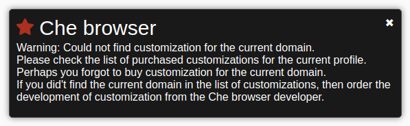
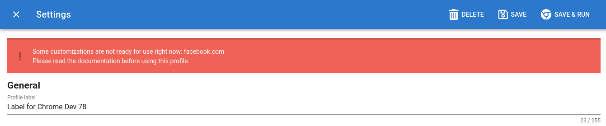
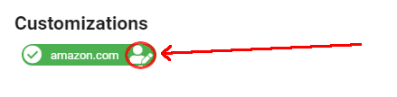
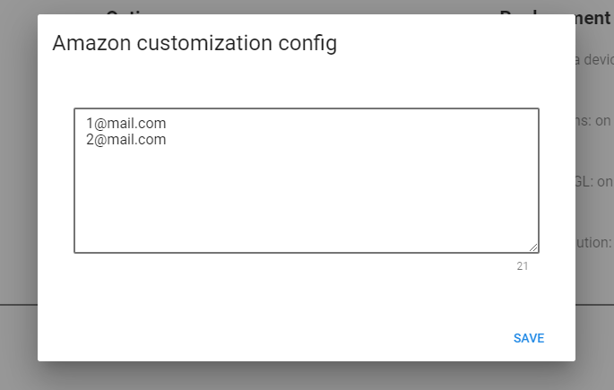
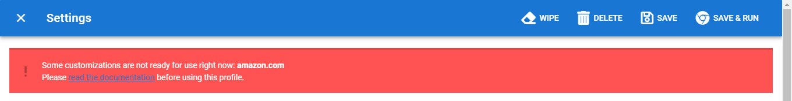

.. |HeavyCheckMark| unicode:: U+2714 .. галочка

.. _customization:

Кастомизации
============
.. contents:: Содержание
   :depth: 3

Что это такое?
--------------
Кастомизация - **адаптация антидетекта** под подмену конкретной реализации того или иного вида отпечатка.

Кастомизация состоит из нескольких частей:

- сбор сэмплов-образцов данных с реальных браузеров (точно таким же кодом как на целевом сайте)
- сэмплы-образцы данных собранные с реальных браузеров
- механизм подмены данных при посещении целевого сайта

Кастомизации могут быть заточены под конкретные сайты (на пример под **paypal.com**) и **массовые**, те которые работают **на тысячах сайтах**.

Как было сказано выше, существуют **публичные javascript библиотеки** для организации браузерного фингерпринтинга.
Эти библиотеки используются на **тысячах сайтах**. И **кастомизации** для этих библиотек включены в каждый профиль по дефолту.
Т.е. при покупке профиля дополнительно ничего не нужно докупать.

| Хотя следует отметить, что есть и кастомизации **под конкретные сайты**.
| Список этих кастомизаций постоянно пополняется и обновляется.
| Т.к. разработка кастомизаций под конкретные сайты бывает довольно не тривиальной задачей, то они тарифицируются отдельно.
| В ближайшее время будет реализован специальный раздел со списком и ценами на кастомизации по конкретным доменам.

Сообщение о том, что кастомизация/сэмплы не найдены
---------------------------------------------------

В процессе работы Вы можете встречать сообщение о том, что  **Che browser** не смог найти кастомизацию или сэмплы для подмены **canvas/audio фингерпринтов**.

Это может свидетельствовать о следующем:

- на сайте используется **уникальное решение** для сбора фингерпринта и требуется разработка кастомизации.
    О разработке кастомизаций читайте ниже.
- Вы **забыли приобрести кастомизацию** для данного домена в момент покупки профиля.
    При учете того, что под данный домен уже реализована кастомизация и доступна для приобретения.
    Пожалуйста проверьте приобретена ли требуемая кастомизация для используемого профиля.
    Посмотреть это можно в окне **Settings** - настройки профиля.
    В поле **Customizations** рядом с названием требуемого домена должна стоять галочка |HeavyCheckMark|
- установленный в системе google chrome не поддерживает **WebGL1** или **WebGL2**
    Прочитайте пункт документации :ref:`problem-webgl2`
- иногда бывает **ложное срабатывание**.
    На сайте используются какие то методы которые так же могут используются при сборе фингерпринта, но совершенно в других целях.
    На пример для **проигрывания звука** или отрисовки картинок на **canvas**.

Так же, иногда после обновления ОС может перестать работать web gl2 и в профилях с кастомизацией на сайтах может начать отображаться, что Че не смог подобрать семплы.
В таких ситуациях проверьте работоспособность web gl2.
Как это сделать описано в разделе :ref:`problem-webgl2`

В любом случае Вы можете просто закрыть сообщение.
А работать или не работать дальше зависит от выше описанных пунктов.

bestbuy.com
-----------
Эту кастомизацию нужно приобрести при покупке профиля если Вы планируете работать с данным ресурсом.
Особых указаний по использованию нет.

facebook.com
------------
Хотелось бы обратить внимание, что у **facebook.com** довольно интересный механизм **canvas фингерпринта**.
Реализован таким образом, что **нельзя** подпихивать одни и те же сэмплы ежедневно.
Каждый день часть сэмплов обновляется, а часть остается прежней.

По этому данная кастомизация может быть доступна для использования **не всегда**.
Если Вы открываете профиль и видите сообщение о том, что кастомизация не доступна в данный момент,
то рекомендую **не использовать данный профиль** и подождать когда кастомизация **станет доступной**.

Это сообщение говорит о том, что новые сэмплы для facebook.com (под этот профиль) еще **не успели собраться**.
И если Вы попытаетесь зайти на **facebook.com** (или сайт с виджетом facebook.com) в этот момент, используя именно этот профиль, то вероятнее всего Вы **спалите аккаунт**.
Т.к. антидетект не сможет выдать требуемые сэмплы facebook'у потому, что их просто еще нет в наличии.

Очень важно **закончить использование** профиля **до 00:00 по UTC (это 03:00 ночи по Москве)**.
В это время часть сэмплов фингерпринта становятся не актуальными и требуется собрать новые.
Я **настоятельно рекомендую** завершать работу с профилем за **15 минут** до указанного выше времени.
И после наступления **00:00 по UTC (это 03:00 ночи по Москве)** переодически открывайте модальное окно настройки профиля, что бы проверить готов ли профиль к использованию.
И в тот момент, когда показанная выше на картинке плашка пропадет профилем можно пользоваться.
Опять до 00:00 по UTC (это 03:00 ночи по Москве)

Отвечу сразу на возникший у Вас вопрос **"Сколько нужно ждать, что бы сэмплы собрались и я мог воспользоваться профилем?"**.
Это зависит от того на сколько быстро на скрипт сбора сэплов зайдет браузер с нужными параметрами.

Количество поставщиков трафика для сбора профилей постоянно увеличивается и в самое ближайшее время этот процесс будет занимать минимальное время.
Но на текущий момент это может занимать несколько часов.

paypal.com
----------
Укажите данную кастомизацию при покупке профиля если планируете взаимодействовать с paypal.com или ebay.com.
В самое ближайшее время будет проведен аудит кода paypal и внесены коррективы, если они требуются.

Так же хотелось бы отметить, что в ближайших релизах будет доработан функционал для взаимодействия с ebay.com.
Т.к. было выявлено еще несколько механизмов при помощи которых ebay.com персонализирует Ваш компьютер.

amazon.com
----------
Фингерпринт в амазон реализован не совсем стандартным образом.
Общая схема canvas фингерпринта выглядит так:

- Первый этап: классический canvas фингерпринт. На canvas рисутся различные геометрические фигуры и накладывается статический текст.
- Второй этап: на картинку из первого этапа накладывается текст с email адресом логина
- Третий этап: амазон получает сырые данные из CanvasRenderingContext2D и строит по этим данных гистограмму

Таким образом амазон отслеживает изменение железа и привязку акаунта к данному железу.
И исходя из выше описанной схемы следует, то что нельзя просто собрать один раз данные с реального браузера.
Т.к. при сборе данных наша система еще не знает какой email Вы будете использовать для логина.
По этой причине был реализован много ступенчатый сбор данных. Во время сбора профиля мы собираем canvas фингерпринт из первого этапа.
Далее, после того как Вы приобрели профиль Вам нужно указать какие email адреса будут использоваться в этом профиле при входе в амазон.
После этого сборщик профилей отслеживает появление подходящего браузера и собирает данные из второго и третьего этапов.

Т.е. после приобретения и настройки профиля Вам нужно будет дождаться, когда сборщик профилей до собирет требуемые сэмплы.
И только после этого Вы сможете использовать этот профиль.
После того как все необходимые данные будут собраны при логине в амазон Вы не увидите сообщений о том, что каки либо сэмплы не были найдены ЧЕ.

И так, для работы с кастомизацией под амазон Вам нужно выполнить следущие действия

- приобрести профиль с кастомизацией под amazon.com
- в настройках профиля (в блоке Customization) найти бэдж в котором будет написано amazon.com
- кликнуть на иконку, как показано на картинке ниже
- в открывшемся модальном окне ввести список email адресов под которыми Вы планируете логиниться в amazon.com. Каждый email должен располагаться на новой строке.
- дождаться когда сборщик профилей до собирет данные с подходящего браузера
- после того как в настройках профиля исчезнет плашка с информацией о том, что еще не все сэмплы собраны можно приступать к работе

Обязательно дождитесь когда эта плашка исчезнет и только после этого начинайте работу.

Сбор требуемых семплов осуществляется только с подходящего браузера (зависит от ОС, браузера и драйверов видео карты).
В среднем сбор данных в дневное время может занимать несколько часов.
В ближайшее время мы увеличим кол-во сайтов на которых размещаются скрипты сбора профилей и процесс до сбора семплов будет проходить на много быстрее.

Заказать разработку кастомизации
--------------------------------
Вы всегда можете обратиться с вопросом о разработке кастомизации **под интересующий Вас сайт**.

| Кастомизации могут быть как **приватными** - не доступны для широкой публики.
| Так и **паблик** - доступны всем пользователям продукта и представлены в общем списке.

Все условия и цены обсуждаются в индивидуальном порядке. Заявки под кастомизации оставлять нашей поддержке.

| **Контакты**
| telegram: `@chebrowser <https://t.me/chebrowser>`_
| jabber: `gcc@bombolenath.site`
| **Поддержка**
| telegram: `@chesupport <https://t.me/chesupport>`_
| jabber: `chesupport@bombolenath.site`

.. include:: yandex-metrika.rst
