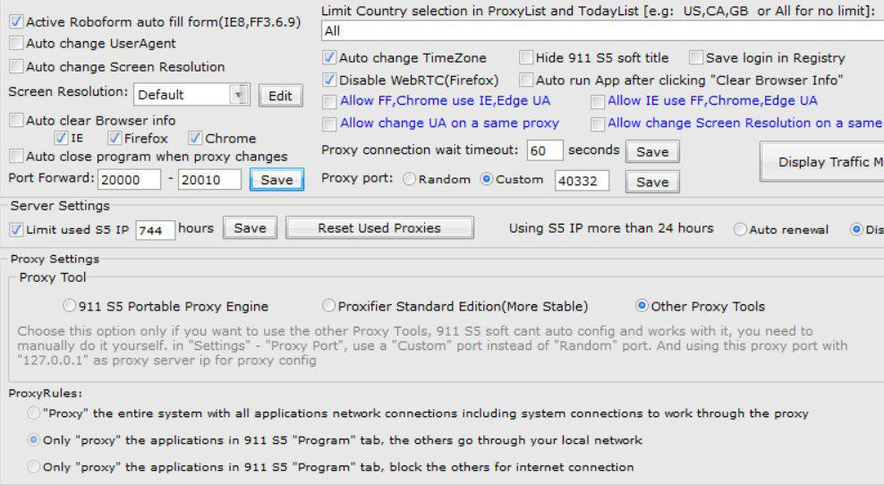
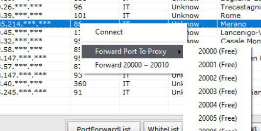
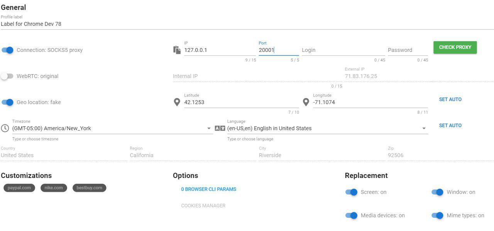
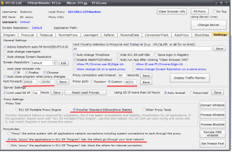
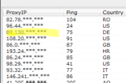
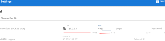
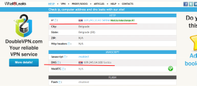

F.A.Q.
======
.. contents:: Содержание
   :depth: 3

Как это все работает?
---------------------
Данный софт состоит из нескольких частей:

- нативное приложение запускаемое на linux или windows
    - Позволяет удобно управлять множеством профилей браузеров
    - Приобретать профили собранные с реальных браузеров
    - Пополнять баланс
    - Продлевать аренду
- расширение для браузера chrome
    - Выполняет подмены различных данных
    - Перехватывает и корректирует разные техники фингерпринта
    - Приминяет кастомизации реализованные под определенные сайты

По этой причине, что бы все завелось, Вам подтребуется установить последнюю версию браузера chrome.
Пожалуйста, устанавливливайте его по дефолту. Это Важно!

Профили
-------
Профиль браузера - это набор самых разнообразных данных, из которых в последствии антифрод системы составляют уникальный отпечаток.

Все предоставляемые нами профили:

 - были собраны с реальных устройств
 - предоставляются только в одни руки
 - не содержат генеренных данных
 - не содержат ГМО ;)

Памятка по горизонтальному скроллу страницы при больших разрешениях
-------------------------------------------------------------------
Мы перенесли подмену разрешения из расширения на уровень исходников хромиум и постарались сделать так, что бы сайты и сервисы получали максимально точные значения разрешения экрана, размера окна, размера вьюпорта и тп.
По этой причине мы решили отображать страницу реального размера.
Если разрешение профиля будет больше чем физическое разрешение Вашего экрана, то Вы увидите страницу уходящую за правый край окна.
Не пугайтесь отсутствию скроллбаров и для горизонтального скролла страницы используйте следующие приемы

 - Зажмите среднюю кнопку мыши и просто тяните страницу влево или вправо, в зависимости куда Вам нужно отскроллить страницу (предпочтительный вариант)
 - Так же можно скроллить кнопками клавиатуры стрелками в лево и в право
 - Либо же можно зажать шифт и крутить колесо мыши

Имейте в виду, что некоторые сайты (на пример paypal.com) собирают информацию по нажатию кнопок клавиатуры, трекинг перемещения мыши. По этой причине на данном этапе мы рекомендуем скролить посредством зажатия средней кнопки мыши.
Мы работаем над еще одним более интеллектуальным и удобным способом скролла. Он появится в одном из ближайших релизов.
К сожалению пока пришлось отказаться от обычных скроллов, т.к. их использование будет заметно специально обученному индусу, который будет разбирать инциденты.

Утечка DNS
----------
В chrome браузере имеется не очень приятный баг.
При первом запуске браузера (с новым профилем) DNS трафик периодами начинает течь в обход сокса.
По этой причине, приходится автоматически закрывать окно браузера при первом запуске и перезапускать браузер снова.
Имейте это ввиду и не пугайтесь, когда окно браузера блымает при первом запуске с новым профилем.

Почему на browserleaks.com я вижу одинаковые фингерпринты?
-----------------------------------------------------------------
Если при тестировании Вы видете одинаковый фингерпринт (на пример canvas) на разных профилях, товероятно Вы еще не прочитали документацию полностью.
Пожалуйста, выделить совсем чуть-чуть времени и сделать это. Начните с раздела :ref:`customization`

Замечу, что на https://browserleaks.com/ используется своя реализация сбора canvas фингерпринта.
Кастомизацию конкретно под https://browserleaks.com/ я не стал реализовывать, т.к. не вижу смысла пускать пыль в глаза.

Попробуйте лучше кастомизацию под bestbuy.com ;)

Использование совместно с 911 proxy
-----------------------------------

В 911 настраиваем port forwarding

- Port Forwading —  20000-20010
- Proxy Tool — Other Proxy Tools

Выбор socks5 proxy

- кликаем правой кнопкой мыши
- выбираем свободный порт

В che browser в настройках socks5 proxy вписываем ip 127.0.0.1 и выбранный ранее порт.

Использование совместно с 911 proxy (Вариант #2)
------------------------------------------------
Данный вариант исключает утечку DNS и для его реализации Вам потребуется proxifire.

- в 911 настраиваем port forwarding: 20000-20050
- proxy port: custom (выставляется автоматически)
- proxy settings: Proxifier standart edition
- proxy rules: only "proxy" the applications in 911 s5 program tab, the others go through your local network
- Выбор socks5 proxy
- кликаем левой кнопкой мыши два раза

Во вкладке Program - выбираем наш браузер  (если его нет то добавляем +)

В che browser в настройках socks5 proxy вписываем ip 127.0.0.1 и выбранный ранее custom порт

Проверяем

Системные требования
--------------------

Виртуальная или реальная машина на windows 7 или windows 10.

- RAM от 2ГБ (лучше 4ГБ+)
- CPU 1 ядро (лучше 2+)

.. include:: yandex-metrika.rst
